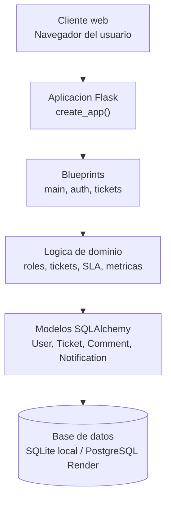
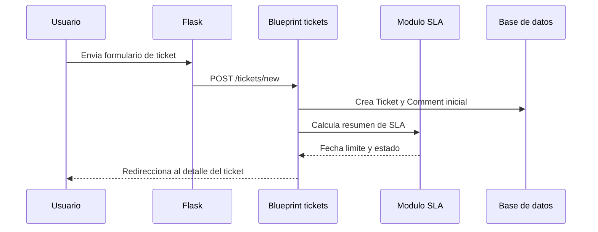

# Arquitectura de OpenDesk

OpenDesk es una aplicacion Flask organizada por capas. La interfaz se renderiza
con plantillas Jinja2 y Bootstrap, mientras que el backend concentra la logica
de autenticacion, tickets, dashboard y SLA mediante blueprints y modelos
SQLAlchemy.

## Diagrama de capas

## Capas principales

| Capa | Archivos | Responsabilidad |
|---|---|---|
| Cliente web | `app/templates/`, `app/static/` | Presenta formularios, listados, dashboard y acciones del sistema. |
| Aplicacion Flask | `app/__init__.py` | Crea la aplicacion, carga configuracion, registra blueprints e inicializa la base de datos. |
| Configuracion | `app/config.py`, `.env.example` | Define variables de entorno, URI de base de datos, llave secreta y carpetas de subida. |
| Extensiones | `app/extensions.py` | Centraliza `db` y `login_manager` para evitar importaciones circulares. |
| Blueprints | `app/main/`, `app/auth/`, `app/tickets/` | Separa rutas por responsabilidad funcional. |
| Modelos | `app/models.py` | Define entidades persistentes y relaciones de dominio. |
| SLA | `app/sla.py` | Calcula vencimientos, progreso visual y escalado de tickets activos. |
| Pruebas | `tests/` | Valida flujos principales con pytest y SQLite temporal. |

## Blueprints existentes

### `main`

Vive en `app/main/routes.py`. Contiene las rutas generales del sistema:

- `/`: pagina de inicio.
- `/health`: healthcheck JSON usado para despliegue y monitoreo.
- `/dashboard`: tablero administrativo protegido por rol `admin`.

El dashboard calcula metricas agregadas como tickets activos, resueltos,
vencidos, prioridad alta, carga por tecnico y tiempo promedio de resolucion.

### `auth`

Vive en `app/auth/routes.py`. Gestiona autenticacion, sesion y perfil:

- `/register`: registro de usuarios con rol.
- `/login`: inicio de sesion.
- `/logout`: cierre de sesion.
- `/profile`: actualizacion de nombre, contrasena y avatar.
- `/notifications`: bandeja interna de notificaciones.

Usa Flask-Login para mantener la sesion del usuario y el modelo `User` para
validar credenciales con hash de contrasena.

### `tickets`

Vive en `app/tickets/routes.py`. Gestiona el ciclo de vida de tickets:

- Listado y filtros.
- Creacion y edicion.
- Asignacion de responsables.
- Cambio de estado.
- Comentarios e historial.
- Notificaciones a participantes.

La visibilidad y las acciones permitidas dependen del rol del usuario actual:
`usuario`, `tecnico` o `admin`.

## Modelos principales

| Modelo | Tabla | Proposito |
|---|---|---|
| `User` | `users` | Representa cuentas, credenciales, rol y avatar. |
| `Ticket` | `tickets` | Representa una solicitud de soporte con estado, prioridad, creador y responsable. |
| `Comment` | `comments` | Guarda comentarios e historial asociado a un ticket. |
| `Notification` | `notifications` | Guarda avisos internos sobre cambios relevantes en tickets. |

## Flujo general de una solicitud

## Decisiones de arquitectura

- Se usa una fabrica `create_app()` para facilitar pruebas y configuraciones por
  entorno.
- Los blueprints separan responsabilidades y mantienen rutas de autenticacion,
  tickets y dashboard en modulos independientes.
- La logica de SLA se mantiene fuera de las rutas para poder probarla y
  reutilizarla en listados, detalles y dashboard.
- Las pruebas usan SQLite temporal, aunque el despliegue en Render puede usar
  PostgreSQL mediante `DATABASE_URL`.

