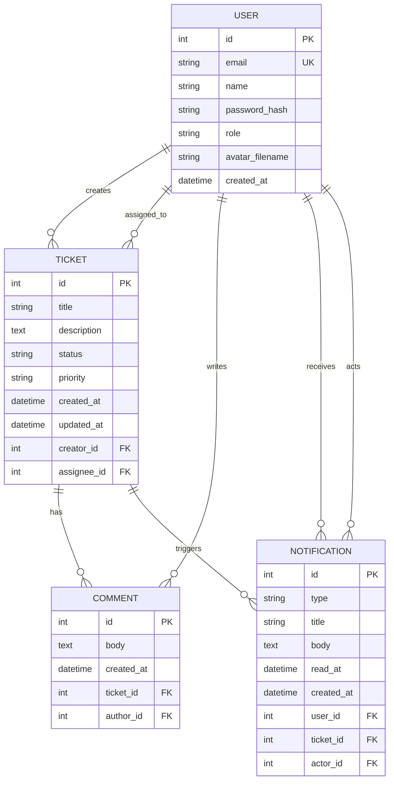
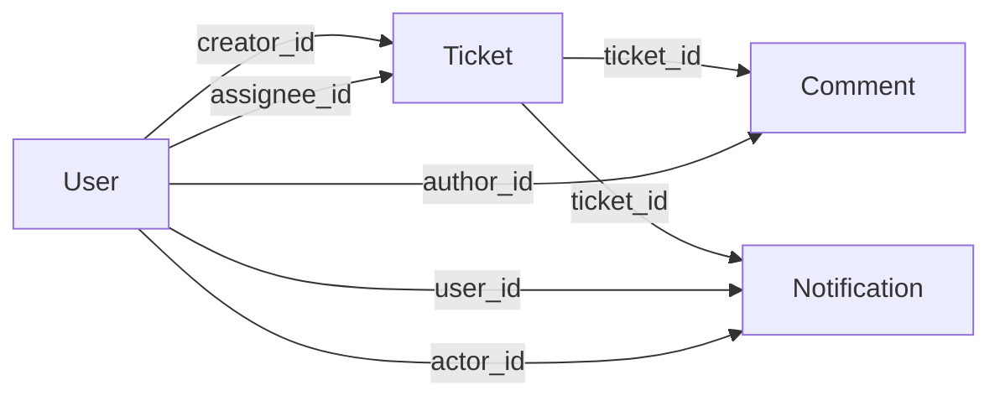

# Modelo de datos

Este documento describe el esquema de datos de OpenDesk con base en los modelos
definidos en `app/models.py`. El sistema usa Flask-SQLAlchemy para mapear las
entidades principales del dominio: usuarios, tickets, comentarios y
notificaciones.

## Diagrama ERD

## Tabla `users`

Modelo: `User`

Representa a las personas que usan el sistema. Hereda de `UserMixin` para
integrarse con Flask-Login.

| Columna | Tipo SQLAlchemy | Restricciones | Descripcion |
|---|---|---|---|
| `id` | `Integer` | Primary key | Identificador interno del usuario. |
| `email` | `String(120)` | `unique=True`, `nullable=False` | Correo usado para login. |
| `name` | `String(120)` | `nullable=False` | Nombre visible del usuario. |
| `password_hash` | `String(255)` | `nullable=False` | Hash de la contrasena. |
| `role` | `String(20)` | `nullable=False`, default `usuario` | Rol de acceso: `usuario`, `tecnico` o `admin`. |
| `avatar_filename` | `String(255)` | `nullable=True` | Nombre del archivo de avatar, si existe. |
| `created_at` | `DateTime` | default `_utcnow` | Fecha de creacion de la cuenta. |

### Relaciones

| Relacion | Modelo destino | Tipo | Descripcion |
|---|---|---|---|
| `Ticket.creator` | `Ticket` | Uno a muchos | Un usuario puede crear varios tickets. |
| `Ticket.assignee` | `Ticket` | Uno a muchos opcional | Un tecnico puede tener tickets asignados. |
| `Comment.author` | `Comment` | Uno a muchos | Un usuario puede escribir varios comentarios. |
| `Notification.user` | `Notification` | Uno a muchos | Un usuario puede recibir varias notificaciones. |
| `Notification.actor` | `Notification` | Uno a muchos opcional | Un usuario puede originar acciones notificables. |

## Tabla `tickets`

Modelo: `Ticket`

Representa una solicitud de soporte dentro de OpenDesk.

| Columna | Tipo SQLAlchemy | Restricciones | Descripcion |
|---|---|---|---|
| `id` | `Integer` | Primary key | Identificador interno del ticket. |
| `title` | `String(200)` | `nullable=False` | Titulo breve de la incidencia. |
| `description` | `Text` | `nullable=False` | Descripcion detallada del problema. |
| `status` | `String(20)` | `nullable=False`, default `abierto` | Estado: `abierto`, `en_proceso`, `resuelto` o `cerrado`. |
| `priority` | `String(20)` | `nullable=False`, default `media` | Prioridad: `baja`, `media` o `alta`. |
| `created_at` | `DateTime` | default `_utcnow` | Fecha de creacion del ticket. |
| `updated_at` | `DateTime` | default `_utcnow`, `onupdate=_utcnow` | Fecha de ultima modificacion. |
| `creator_id` | `Integer` | FK `users.id`, `nullable=False` | Usuario que creo el ticket. |
| `assignee_id` | `Integer` | FK `users.id`, `nullable=True` | Tecnico responsable, si fue asignado. |

### Relaciones

| Relacion | Modelo destino | Tipo | Descripcion |
|---|---|---|---|
| `creator` | `User` | Muchos a uno | Usuario solicitante del ticket. |
| `assignee` | `User` | Muchos a uno opcional | Tecnico responsable del ticket. |
| `comments` | `Comment` | Uno a muchos | Comentarios e historial asociados al ticket. |
| `Notification.ticket` | `Notification` | Uno a muchos | Notificaciones generadas por eventos del ticket. |

## Tabla `comments`

Modelo: `Comment`

Guarda comentarios manuales y eventos de historial asociados a un ticket.

| Columna | Tipo SQLAlchemy | Restricciones | Descripcion |
|---|---|---|---|
| `id` | `Integer` | Primary key | Identificador interno del comentario. |
| `body` | `Text` | `nullable=False` | Texto del comentario o evento. |
| `created_at` | `DateTime` | default `_utcnow` | Fecha de creacion. |
| `ticket_id` | `Integer` | FK `tickets.id`, `nullable=False` | Ticket relacionado. |
| `author_id` | `Integer` | FK `users.id`, `nullable=False` | Usuario que escribio el comentario. |

### Relaciones

| Relacion | Modelo destino | Tipo | Descripcion |
|---|---|---|---|
| `ticket` | `Ticket` | Muchos a uno | Ticket al que pertenece el comentario. |
| `author` | `User` | Muchos a uno | Usuario que escribio el comentario. |

## Tabla `notifications`

Modelo: `Notification`

Guarda avisos internos para los usuarios cuando ocurre un evento relevante en un
ticket.

| Columna | Tipo SQLAlchemy | Restricciones | Descripcion |
|---|---|---|---|
| `id` | `Integer` | Primary key | Identificador interno de la notificacion. |
| `type` | `String(40)` | `nullable=False` | Tipo de evento: asignacion, comentario, estado, etc. |
| `title` | `String(160)` | `nullable=False` | Titulo visible de la notificacion. |
| `body` | `Text` | `nullable=False` | Detalle del evento notificado. |
| `read_at` | `DateTime` | `nullable=True` | Fecha de lectura; `NULL` significa no leida. |
| `created_at` | `DateTime` | default `_utcnow` | Fecha de creacion. |
| `user_id` | `Integer` | FK `users.id`, `nullable=False` | Usuario destinatario. |
| `ticket_id` | `Integer` | FK `tickets.id`, `nullable=False` | Ticket relacionado. |
| `actor_id` | `Integer` | FK `users.id`, `nullable=True` | Usuario que origino la accion. |

### Relaciones

| Relacion | Modelo destino | Tipo | Descripcion |
|---|---|---|---|
| `user` | `User` | Muchos a uno | Usuario que recibe la notificacion. |
| `ticket` | `Ticket` | Muchos a uno | Ticket asociado al evento. |
| `actor` | `User` | Muchos a uno opcional | Usuario que genero el evento. |

### Propiedad `is_read`

La propiedad `is_read` devuelve `True` cuando `read_at` no es `None`. Se usa para
identificar si una notificacion ya fue leida.

## Restricciones funcionales

Aunque algunas reglas se validan a nivel de aplicacion y no como constraints de
base de datos, forman parte del modelo de dominio:

| Regla | Donde se aplica |
|---|---|
| El correo de usuario debe ser unico. | Restriccion `unique=True` en `User.email`. |
| El rol debe estar dentro de `usuario`, `tecnico` o `admin`. | Validacion en `app/auth/routes.py`. |
| El estado debe estar dentro de `abierto`, `en_proceso`, `resuelto` o `cerrado`. | Validacion en `app/tickets/routes.py`. |
| La prioridad debe estar dentro de `baja`, `media` o `alta`. | Validacion en `app/tickets/routes.py`. |
| Un ticket siempre debe tener creador. | `Ticket.creator_id nullable=False`. |
| Un comentario siempre debe tener ticket y autor. | `Comment.ticket_id` y `Comment.author_id nullable=False`. |
| Una notificacion siempre debe tener destinatario y ticket. | `Notification.user_id` y `Notification.ticket_id nullable=False`. |

## Flujo de relaciones

## Consideraciones de persistencia

- En local, el proyecto puede usar SQLite.
- En Render, la configuracion permite usar PostgreSQL mediante `DATABASE_URL`.
- Las tablas se crean desde `db.create_all()` durante la inicializacion de la
  aplicacion.
- La funcion `_ensure_user_avatar_column()` en `app/__init__.py` agrega la
  columna `avatar_filename` si una base existente aun no la tiene.

