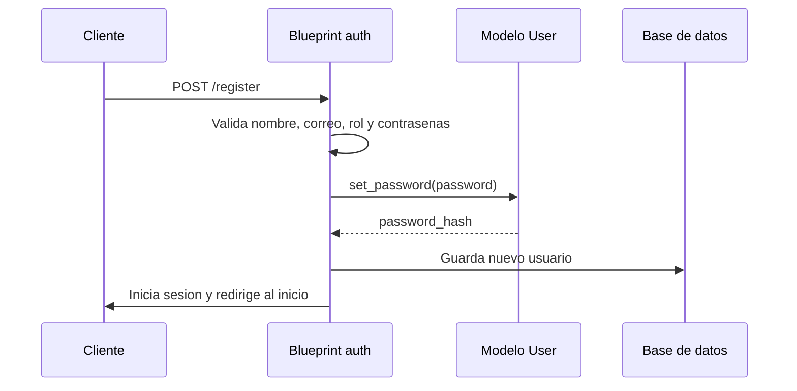
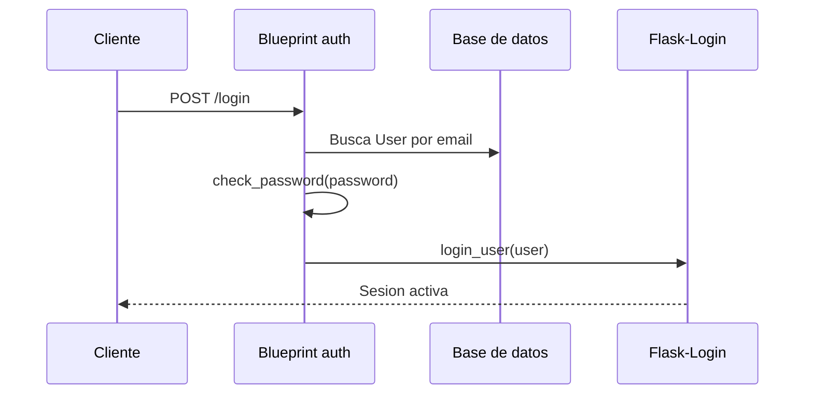

# Modulo 1: Autenticacion y roles

Este modulo cubre el registro, inicio y cierre de sesion, administracion basica
del perfil, notificaciones internas y control de acceso por rol. La
implementacion principal vive en `app/auth/routes.py`, apoyada por el modelo
`User` definido en `app/models.py`.

## Objetivo del modulo

Permitir que cada persona use OpenDesk con una identidad propia y un rol que
defina sus permisos dentro del flujo de soporte. El sistema diferencia tres
perfiles:

- `usuario`: reporta incidencias y consulta el avance de sus tickets.
- `tecnico`: atiende tickets asignados o sin responsable.
- `admin`: supervisa la operacion, asigna responsables y consulta metricas.

## Endpoints

| Metodo | Ruta | Funcion | Acceso |
|---|---|---|---|
| GET | `/register` | Muestra el formulario de registro. | Publico |
| POST | `/register` | Crea una cuenta con nombre, correo, rol y contrasena. | Publico |
| GET | `/login` | Muestra el formulario de inicio de sesion. | Publico |
| POST | `/login` | Valida credenciales e inicia sesion con Flask-Login. | Publico |
| GET | `/logout` | Cierra la sesion actual. | Usuario autenticado |
| GET | `/profile` | Muestra informacion del perfil. | Usuario autenticado |
| POST | `/profile` | Actualiza nombre, contrasena y avatar. | Usuario autenticado |
| GET | `/notifications` | Lista notificaciones internas del usuario. | Usuario autenticado |
| POST | `/notifications/<notification_id>/read` | Marca una notificacion como leida y abre el ticket relacionado. | Usuario autenticado |
| POST | `/notifications/read-all` | Marca todas las notificaciones del usuario como leidas. | Usuario autenticado |

## Modelo `User`

El modelo `User` se encuentra en `app/models.py` y hereda de `UserMixin` para
integrarse con Flask-Login.

| Campo | Tipo | Restricciones | Uso |
|---|---|---|---|
| `id` | `Integer` | Llave primaria | Identificador interno del usuario. |
| `email` | `String(120)` | Unico, requerido | Correo usado para login. |
| `name` | `String(120)` | Requerido | Nombre mostrado en la interfaz. |
| `password_hash` | `String(255)` | Requerido | Hash seguro de la contrasena. |
| `role` | `String(20)` | Requerido, default `usuario` | Define permisos: `usuario`, `tecnico` o `admin`. |
| `avatar_filename` | `String(255)` | Opcional | Nombre del archivo de avatar subido. |
| `created_at` | `DateTime` | Default `_utcnow` | Fecha de creacion de la cuenta. |

Metodos relevantes:

- `set_password(password)`: genera y guarda el hash de la contrasena con
  Werkzeug.
- `check_password(password)`: valida una contrasena en texto plano contra el
  hash guardado.
- `load_user(user_id)`: recupera un usuario por ID para Flask-Login.

## Roles y permisos

| Rol | Puede hacer | Restricciones principales |
|---|---|---|
| `usuario` | Crear tickets, ver sus tickets, editar tickets propios, comentar en tickets visibles y cerrar tickets resueltos propios. | No puede asignar responsables ni ver tickets ajenos. |
| `tecnico` | Ver tickets asignados a el o sin responsable, comentar y cambiar estado a `en_proceso` o `resuelto`. | No puede asignar responsables ni ver tickets asignados a otro tecnico. |
| `admin` | Ver todos los tickets, asignar responsables, cambiar cualquier estado valido y acceder al dashboard. | Debe estar autenticado. |

La seleccion de rol ocurre durante el registro con `ROLE_OPTIONS` y se valida
contra `VALID_ROLES` en `app/auth/routes.py`.

## Control de acceso

El control de acceso se aplica en dos niveles:

1. Autenticacion con `@login_required`.
2. Reglas de rol dentro de las rutas de tickets y dashboard.

En `app/auth/routes.py`, las rutas sensibles como `/logout`, `/profile` y
`/notifications` usan `@login_required`. Esto obliga a que exista una sesion
activa antes de ejecutar la vista.

El modulo de autenticacion no decide todos los permisos de negocio por si solo.
El rol guardado en `User.role` se usa despues en:

- `app/main/routes.py`: la ruta `/dashboard` permite acceso solo a `admin`.
- `app/tickets/routes.py`: helpers como `_can_view_ticket`,
  `_can_edit_ticket` y `_allowed_statuses` definen que tickets puede ver o
  modificar cada rol.

## Flujo de registro

## Flujo de login

## Notificaciones internas

Las notificaciones se almacenan en el modelo `Notification`. Desde el modulo de
autenticacion se consultan y se marcan como leidas, pero su creacion ocurre
principalmente desde `app/tickets/routes.py` cuando hay cambios relevantes en un
ticket.

Eventos que pueden generar notificaciones:

- Asignacion o reasignacion de tecnico.
- Cambio de estado.
- Nuevo comentario.

## Validaciones relevantes

- No se permite registrar usuarios con correo repetido.
- El rol enviado en el formulario debe existir en `VALID_ROLES`.
- La confirmacion de contrasena debe coincidir.
- El cambio de contrasena desde perfil requiere la contrasena actual.
- El avatar debe tener extension valida: `gif`, `jpeg`, `jpg`, `png` o `webp`.

## Archivos relacionados

| Archivo | Responsabilidad |
|---|---|
| `app/auth/routes.py` | Rutas y validaciones de autenticacion, perfil y notificaciones. |
| `app/models.py` | Modelo `User` y relacion con notificaciones, tickets y comentarios. |
| `app/templates/auth/login.html` | Formulario de inicio de sesion. |
| `app/templates/auth/register.html` | Formulario de registro. |
| `app/templates/auth/profile.html` | Edicion de perfil. |
| `app/templates/auth/notifications.html` | Bandeja de notificaciones. |
| `tests/test_smoke.py` | Pruebas de autenticacion, perfil, roles y notificaciones. |

