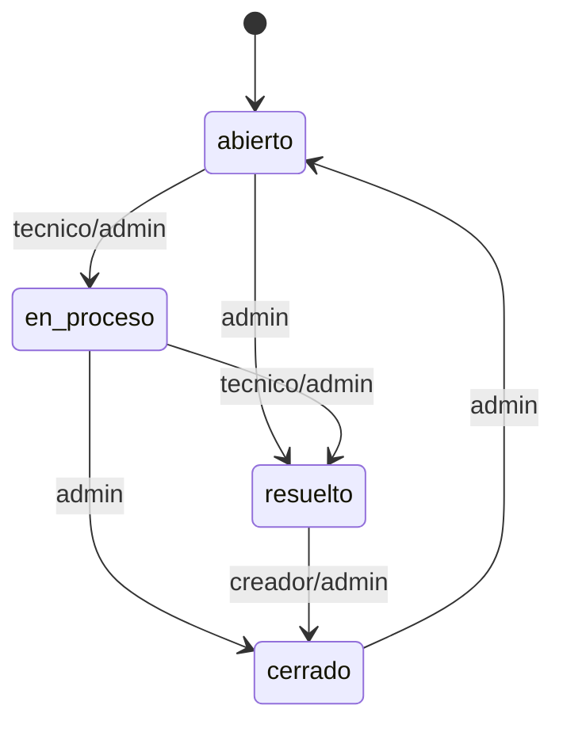

# Modulo 2: Gestion de tickets

Este modulo implementa el flujo principal de soporte de OpenDesk: crear tickets,
consultarlos, asignar responsables, cambiar estado y registrar comentarios. La
logica vive en `app/tickets/routes.py` y usa los modelos `Ticket`, `Comment`,
`Notification` y `User` definidos en `app/models.py`.

## Objetivo del modulo

Centralizar las solicitudes de soporte en tickets trazables. Cada ticket tiene
un solicitante, una prioridad, un estado, un responsable opcional y un historial
de comentarios o cambios relevantes.

## Endpoints

| Metodo | Ruta | Funcion | Acceso |
|---|---|---|---|
| GET | `/tickets/` | Lista tickets visibles para el usuario actual. | Autenticado |
| GET | `/tickets/new` | Muestra el formulario de creacion. | Autenticado |
| POST | `/tickets/new` | Crea un ticket con titulo, descripcion y prioridad. | Autenticado |
| GET | `/tickets/<ticket_id>` | Muestra detalle, SLA, comentarios y acciones disponibles. | Segun permisos |
| GET | `/tickets/<ticket_id>/edit` | Muestra formulario de edicion. | Admin o creador |
| POST | `/tickets/<ticket_id>/edit` | Actualiza titulo, descripcion y prioridad. | Admin o creador |
| POST | `/tickets/<ticket_id>/assign` | Asigna o quita tecnico responsable. | Admin |
| POST | `/tickets/<ticket_id>/status` | Cambia el estado del ticket. | Segun rol y estado |
| POST | `/tickets/<ticket_id>/comments` | Agrega un comentario al historial. | Segun visibilidad |

## Modelo `Ticket`

El modelo `Ticket` representa una solicitud de soporte.

| Campo | Tipo | Restricciones | Uso |
|---|---|---|---|
| `id` | `Integer` | Llave primaria | Identificador del ticket. |
| `title` | `String(200)` | Requerido | Resumen corto del problema. |
| `description` | `Text` | Requerido | Detalle de la solicitud. |
| `status` | `String(20)` | Requerido, default `abierto` | Estado actual del ticket. |
| `priority` | `String(20)` | Requerido, default `media` | Prioridad usada tambien por SLA. |
| `created_at` | `DateTime` | Default `_utcnow` | Fecha de creacion. |
| `updated_at` | `DateTime` | Default y `onupdate` `_utcnow` | Fecha de ultima actualizacion. |
| `creator_id` | `Integer` | FK a `users.id`, requerido | Usuario que creo el ticket. |
| `assignee_id` | `Integer` | FK a `users.id`, opcional | Tecnico responsable. |

Relaciones:

- `creator`: usuario solicitante.
- `assignee`: tecnico responsable, si existe.
- `comments`: historial de comentarios por medio de `Comment.ticket`.

## Modelo `Comment`

El modelo `Comment` guarda tanto comentarios manuales como eventos internos del
historial del ticket.

| Campo | Tipo | Restricciones | Uso |
|---|---|---|---|
| `id` | `Integer` | Llave primaria | Identificador del comentario. |
| `body` | `Text` | Requerido | Texto del comentario o evento. |
| `created_at` | `DateTime` | Default `_utcnow` | Fecha de creacion. |
| `ticket_id` | `Integer` | FK a `tickets.id`, requerido | Ticket relacionado. |
| `author_id` | `Integer` | FK a `users.id`, requerido | Usuario que genero el comentario. |

Relaciones:

- `ticket`: ticket al que pertenece.
- `author`: usuario que escribio el comentario o genero el evento.

## Estados del ticket

Estados soportados en `STATUS_META`:

| Estado | Descripcion |
|---|---|
| `abierto` | Ticket creado y pendiente de atencion. |
| `en_proceso` | Ticket tomado por soporte. |
| `resuelto` | El tecnico o administrador marco el caso como atendido. |
| `cerrado` | El caso quedo finalizado. |

## Maquina de estados

La funcion `_allowed_statuses(ticket, user)` determina que transiciones puede
ejecutar cada usuario:

- `admin`: puede cambiar a cualquier estado distinto del actual.
- `tecnico`: puede pasar tickets activos a `en_proceso` o `resuelto`.
- `usuario`: si es creador, puede cerrar un ticket cuando esta `resuelto`.

## Prioridades

Prioridades soportadas en `PRIORITY_META` y `PRIORITY_OPTIONS`:

| Prioridad | Uso esperado |
|---|---|
| `baja` | Solicitud simple o no urgente. |
| `media` | Problema que afecta el trabajo normal. |
| `alta` | Incidencia critica que requiere atencion inmediata. |

La prioridad tambien alimenta la logica de SLA en `app/sla.py`.

## Reglas de visibilidad

La funcion `_can_view_ticket(ticket, user)` define que tickets puede ver cada
rol:

| Rol | Tickets visibles |
|---|---|
| `usuario` | Tickets creados por el mismo. |
| `tecnico` | Tickets asignados a el o tickets sin responsable. |
| `admin` | Todos los tickets. |

La funcion `_visible_tickets_for(user)` aplica estas reglas antes de mostrar el
listado.

## Reglas de edicion

La funcion `_can_edit_ticket(ticket, user)` permite editar un ticket cuando:

- El usuario es `admin`.
- El usuario es el creador del ticket.

Los tecnicos pueden atender y comentar tickets visibles, pero no editar titulo,
descripcion o prioridad si no son creadores o administradores.

## Asignacion de responsables

La ruta `POST /tickets/<ticket_id>/assign` permite a un `admin` asignar un
tecnico o dejar el ticket sin responsable.

Validaciones principales:

- Solo `admin` puede asignar.
- El `assignee_id` debe pertenecer a un usuario existente con rol `tecnico`.
- Si `assignee_id` viene vacio, el ticket queda sin asignar.

Cada asignacion agrega un comentario de historial con `_add_ticket_history()` y
notifica a los usuarios involucrados.

## Comentarios e historial

La ruta `POST /tickets/<ticket_id>/comments` agrega comentarios visibles en el
detalle del ticket. Tambien se usan comentarios internos para registrar eventos
como:

- Creacion del ticket.
- Cambio de responsable.
- Cambio de estado.
- Edicion de titulo, descripcion o prioridad.

Estos eventos permiten reconstruir la historia de cada caso sin depender solo
del estado actual.

## Filtros del listado

El listado `/tickets/` permite filtrar por:

- Texto en titulo o descripcion.
- Estado.
- Prioridad.
- Creador.
- Responsable.
- Tickets sin asignar.

La funcion `_filter_tickets(tickets, filters)` aplica estos filtros sobre los
tickets que el usuario ya tiene permiso de ver.

## Notificaciones relacionadas

El modulo de tickets crea notificaciones internas cuando ocurre un evento que
debe ser visible para otros participantes:

- Cambio de responsable.
- Cambio de estado.
- Nuevo comentario.

La funcion `_notification_recipients(ticket, *extra_users)` evita duplicar
destinatarios y no notifica al usuario que realizo la accion.

## Archivos relacionados

| Archivo | Responsabilidad |
|---|---|
| `app/tickets/routes.py` | Rutas, permisos y logica principal de tickets. |
| `app/models.py` | Modelos `Ticket`, `Comment`, `Notification` y relaciones con `User`. |
| `app/sla.py` | Calculo de vencimiento y resumen SLA mostrado en tickets. |
| `app/templates/tickets/list.html` | Listado y filtros de tickets. |
| `app/templates/tickets/detail.html` | Detalle, comentarios, SLA y acciones. |
| `app/templates/tickets/new.html` | Formulario de creacion. |
| `app/templates/tickets/edit.html` | Formulario de edicion. |
| `tests/test_smoke.py` | Pruebas de creacion, visibilidad, asignacion, estados y comentarios. |

