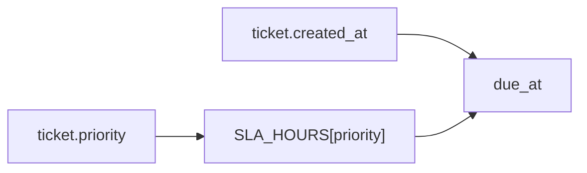
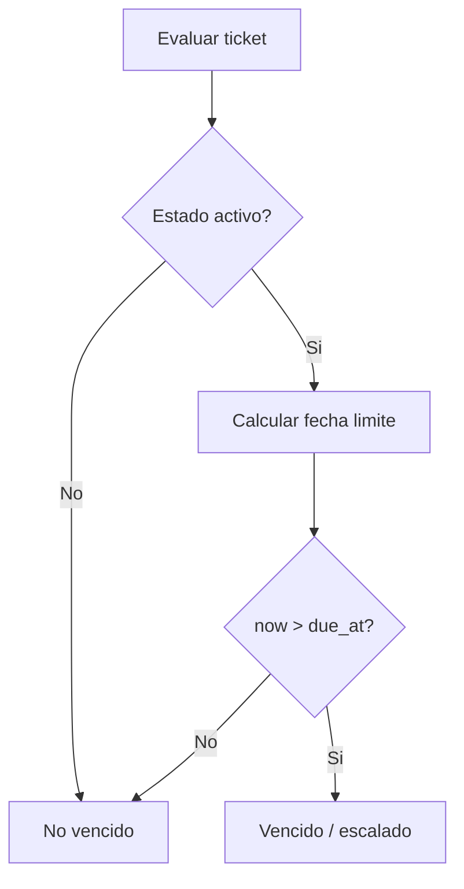

# Modulo 3: SLA y escalado

Este modulo calcula los tiempos limite de atencion para tickets segun su
prioridad, detecta tickets vencidos y expone datos para mostrar el estado del
SLA en listados, detalle y dashboard. La implementacion principal vive en
`app/sla.py`.

## Objetivo del modulo

Dar seguimiento automatico al tiempo de atencion de cada ticket activo. OpenDesk
usa la prioridad del ticket para calcular una fecha limite y marcar visualmente
cuando un caso esta dentro de tiempo, en observacion, urgente o vencido.

## Prioridades y tiempos limite

La constante `SLA_HOURS` en `app/sla.py` define el tiempo maximo permitido por
prioridad:

| Prioridad | Tiempo limite | Uso esperado |
|---|---:|---|
| `alta` | 4 horas | Incidencias criticas que requieren atencion inmediata. |
| `media` | 24 horas | Problemas que afectan el trabajo normal. |
| `baja` | 72 horas | Solicitudes simples o no urgentes. |

Si una prioridad no existe en el diccionario, la logica usa `media` como valor
por defecto.

## Estados activos

La constante `ACTIVE_STATUSES` define que estados cuentan para SLA:

```python
ACTIVE_STATUSES = {"abierto", "en_proceso"}
```

Solo los tickets en esos estados pueden marcarse como vencidos. Los tickets
`resuelto` y `cerrado` no se consideran vencidos aunque su fecha limite ya haya
pasado.

## Funciones principales

| Funcion | Responsabilidad |
|---|---|
| `_as_aware_utc(value)` | Normaliza fechas para trabajar con zona horaria UTC. |
| `sla_due_at(ticket)` | Calcula la fecha limite sumando las horas de SLA a `ticket.created_at`. |
| `is_sla_overdue(ticket, now=None)` | Devuelve `True` si el ticket activo ya paso su fecha limite. |
| `sla_summary(ticket, now=None)` | Devuelve un resumen con vencimiento, porcentaje, clase visual y etiqueta. |
| `sla_summaries(tickets, now=None)` | Genera un resumen SLA por cada ticket recibido. |

## Calculo de fecha limite

La funcion `sla_due_at(ticket)` toma la fecha de creacion del ticket y le suma el
numero de horas configurado para su prioridad.



Ejemplo:

- Un ticket `alta` creado a las 10:00 vence a las 14:00.
- Un ticket `media` creado el lunes a las 09:00 vence el martes a las 09:00.
- Un ticket `baja` creado el lunes a las 09:00 vence el jueves a las 09:00.

## Logica de vencimiento

La funcion `is_sla_overdue(ticket, now=None)` sigue esta regla:

1. Si el ticket no esta en `abierto` o `en_proceso`, devuelve `False`.
2. Calcula la fecha actual en UTC.
3. Calcula la fecha limite con `sla_due_at(ticket)`.
4. Devuelve `True` si la fecha actual es mayor que la fecha limite.



## Escalado automatico

El escalado se representa en `sla_summary(ticket)` con el campo `escalated`.
Actualmente su valor es igual a `overdue`, por lo que un ticket activo vencido
queda marcado automaticamente como escalado.

Campos relevantes del resumen:

| Campo | Descripcion |
|---|---|
| `due_at` | Fecha limite calculada. |
| `hours` | Horas maximas permitidas por prioridad. |
| `overdue` | Indica si el ticket activo ya vencio. |
| `escalated` | Indica si el ticket debe considerarse escalado. |
| `elapsed_percent` | Porcentaje de tiempo consumido respecto al SLA. |
| `bar_percent` | Porcentaje limitado a 100 para mostrar barra visual. |
| `bar_class` | Clase CSS usada para colorear la barra. |
| `status_label` | Texto de estado mostrado al usuario. |

## Umbrales visuales

`sla_summary(ticket)` asigna una clase visual y una etiqueta segun el porcentaje
de tiempo consumido:

| Condicion | Clase | Etiqueta |
|---|---|---|
| Ticket vencido | `od-sla-red` | `Tiempo vencido` |
| 75% o mas del tiempo | `od-sla-orange` | `Atencion urgente` |
| 50% o mas del tiempo | `od-sla-yellow` | `En observacion` |
| Menos de 50% | `od-sla-green` | `Dentro de tiempo` |

Esto permite detectar tickets cercanos a vencer antes de que incumplan el SLA.

## Uso en tickets

El modulo `app/tickets/routes.py` consume la logica de SLA en dos lugares:

- En `/tickets/`, con `sla_summaries(tickets)` para mostrar estado SLA en el
  listado.
- En `/tickets/<ticket_id>`, con `sla_summaries([ticket])[ticket.id]` para
  mostrar el detalle del SLA del ticket.

Ademas, `_ticket_stats(tickets)` usa `is_sla_overdue(ticket)` para contar los
tickets vencidos del listado.

## Uso en dashboard

El modulo `app/main/routes.py` usa SLA para metricas administrativas:

- `overdue_tickets`: tickets vencidos segun `is_sla_overdue(ticket)`.
- `metrics["totals"]["overdue"]`: total de tickets vencidos.
- `metrics["sla_by_ticket"]`: resumen SLA de tickets para la vista.

Estas metricas se muestran en `app/templates/dashboard.html` para que el
administrador identifique carga, vencimientos y tickets prioritarios.

## Consideraciones tecnicas

- Todas las fechas se normalizan a UTC con `_as_aware_utc(value)`.
- `now` es opcional en las funciones para facilitar pruebas deterministas.
- El calculo de SLA no modifica la base de datos; devuelve informacion derivada
  del estado actual del ticket.
- El escalado automatico es logico/visual: un ticket activo vencido queda
  marcado como escalado en el resumen SLA.

## Archivos relacionados

| Archivo | Responsabilidad |
|---|---|
| `app/sla.py` | Define tiempos limite, vencimiento, resumen y escalado. |
| `app/tickets/routes.py` | Muestra SLA en listado, detalle y estadisticas de tickets. |
| `app/main/routes.py` | Calcula metricas de dashboard con tickets vencidos. |
| `app/templates/tickets/list.html` | Muestra indicadores SLA en el listado. |
| `app/templates/tickets/detail.html` | Muestra fecha limite y estado SLA del ticket. |
| `app/templates/dashboard.html` | Muestra metricas administrativas de vencimiento. |
| `tests/test_smoke.py` | Valida SLA vencido, escalado y umbrales visuales. |

