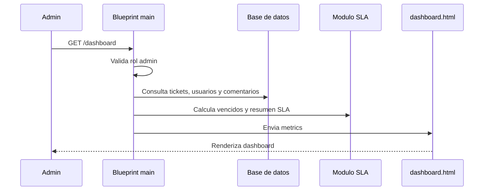

# Modulo 4: Dashboard de metricas

Este modulo concentra la vista ejecutiva de OpenDesk para administradores. Su
objetivo es mostrar el estado operativo de la mesa de ayuda: volumen de tickets,
actividad reciente, vencimientos SLA, carga por tecnico y distribucion por
estado o prioridad.

La ruta principal vive en `app/main/routes.py` y la interfaz se renderiza con
`app/templates/dashboard.html`.

## Objetivo del modulo

Dar a los usuarios con rol `admin` una vista de alto nivel para supervisar el
soporte. El dashboard ayuda a responder preguntas como:

- Cuantos tickets hay registrados.
- Cuantos tickets siguen activos.
- Cuantos estan resueltos o cerrados.
- Cuantos estan sin responsable.
- Cuantos vencieron su SLA.
- Que tecnicos tienen mas carga activa.
- Cuales son los tickets recientes o escalados.

## Endpoint principal

| Metodo | Ruta | Funcion | Acceso |
|---|---|---|---|
| GET | `/dashboard` | Muestra el dashboard administrativo con metricas agregadas. | Solo `admin` |

La vista usa `@login_required` y valida explicitamente:

```python
if current_user.role != "admin":
    abort(403)
```

Por esta razon, cualquier usuario autenticado sin rol `admin` recibe respuesta
`403 Forbidden`.

## Archivos involucrados

| Archivo | Responsabilidad |
|---|---|
| `app/main/routes.py` | Define la ruta `/dashboard` y calcula las metricas. |
| `app/templates/dashboard.html` | Renderiza tarjetas, barras, listados y paneles del dashboard. |
| `app/models.py` | Provee los modelos `Ticket`, `User` y `Comment`. |
| `app/sla.py` | Provee `is_sla_overdue` y `sla_summaries`. |
| `tests/test_smoke.py` | Valida acceso admin y render de metricas principales. |

## Funciones de soporte

### `_percent(value, total)`

Calcula porcentajes para las barras visuales del dashboard. Si el total es cero,
devuelve `0` para evitar division entre cero.

### `_average_resolution_hours(tickets)`

Calcula el tiempo promedio de resolucion usando tickets en estado `resuelto` o
`cerrado`. Para cada ticket toma la diferencia entre `updated_at` y `created_at`,
convierte a horas y devuelve el promedio redondeado a un decimal.

Si no existen tickets resueltos o cerrados, devuelve `None`.

### `_dashboard_metrics()`

Centraliza el calculo de todas las metricas que consume la plantilla. Consulta
tickets, usuarios y comentarios, y construye un diccionario `metrics` con
totales, filas para graficas, carga por tecnico, tickets recientes y tickets
vencidos.

## Metricas principales

El bloque `metrics["totals"]` contiene los contadores usados en las tarjetas
superiores.

| Metrica | Calculo | Uso en interfaz |
|---|---|---|
| `tickets` | Total de tickets consultados. | Tarjeta "Tickets". |
| `users` | Total de usuarios registrados. | Chip informativo. |
| `comments` | Total de comentarios registrados. | Chip informativo. |
| `active` | Tickets `abierto` + `en_proceso`. | Tarjeta "Activos". |
| `resolved` | Tickets `resuelto` + `cerrado`. | Tarjeta "Resueltos". |
| `unassigned` | Tickets con `assignee_id is None`. | Tarjeta "Sin asignar". |
| `high_priority` | Tickets con prioridad `alta`. | Resumen de operacion actual. |
| `overdue` | Tickets donde `is_sla_overdue(ticket)` es `True`. | Tarjeta "Vencidos". |
| `avg_resolution_hours` | Promedio de horas de resolucion. | Tarjeta "Promedio" y panel "Resolucion". |

## Distribucion por estado

`status_rows` se calcula a partir de `STATUS_LABELS`:

| Estado | Etiqueta |
|---|---|
| `abierto` | Abiertos |
| `en_proceso` | En proceso |
| `resuelto` | Resueltos |
| `cerrado` | Cerrados |

Cada fila incluye:

- `key`: estado interno.
- `label`: etiqueta visible.
- `count`: numero de tickets en ese estado.
- `percent`: porcentaje respecto al total.

En `dashboard.html` se muestra como barras de progreso en la seccion
"Estados".

## Distribucion por prioridad

`priority_rows` se calcula a partir de `PRIORITY_LABELS`:

| Prioridad | Etiqueta | Color visual |
|---|---|---|
| `baja` | Baja | Secundario |
| `media` | Media | Info |
| `alta` | Alta | Rojo / peligro |

Cada fila incluye `count` y `percent` para mostrar la proporcion de tickets por
prioridad en la seccion "Prioridad".

## Abiertos vs cerrados

`open_closed_rows` compara tickets activos contra tickets resueltos o cerrados:

| Fila | Calculo |
|---|---|
| Abiertos | `abierto` + `en_proceso` |
| Resueltos o cerrados | `resuelto` + `cerrado` |

Esta comparacion permite ver rapidamente que parte de la carga sigue pendiente y
que parte ya fue atendida.

## Carga por tecnico

La seccion "Carga por tecnico" usa usuarios con rol `tecnico` o `admin`:

```python
technicians = [user for user in users if user.role in ("tecnico", "admin")]
```

Para cada persona calcula:

| Campo | Calculo |
|---|---|
| `assigned` | Tickets asignados a ese usuario. |
| `active` | Tickets asignados con estado `abierto` o `en_proceso`. |
| `high_priority` | Tickets asignados con prioridad `alta`. |

La lista se ordena por mayor carga activa y mayor cantidad de tickets asignados.

## Tickets vencidos

La metrica de vencidos usa:

```python
overdue_tickets = [ticket for ticket in tickets if is_sla_overdue(ticket)]
```

El dashboard muestra hasta cinco tickets vencidos en la seccion "SLA". Para cada
ticket se muestra:

- Titulo del ticket.
- Insignia de "Escalado".
- Fecha limite calculada con `metrics.sla_by_ticket[ticket.id].due_at`.

## Actividad reciente

`recent_tickets` toma los primeros cinco tickets ordenados por:

1. `updated_at` descendente.
2. `created_at` descendente.

La plantilla muestra titulo, ID, estado, prioridad y una insignia de `vencido`
si el resumen SLA indica que el ticket esta fuera de tiempo.

## Flujo del dashboard



## Pruebas relacionadas

La suite valida que:

- `/dashboard` redirige si no hay sesion activa.
- Un usuario sin rol `admin` recibe `403`.
- Un usuario `admin` puede ver el dashboard.
- Las metricas se renderizan con tickets, tecnicos y comentarios existentes.

Antes de abrir el PR de este modulo se debe ejecutar:

```powershell
python -m pytest
```

